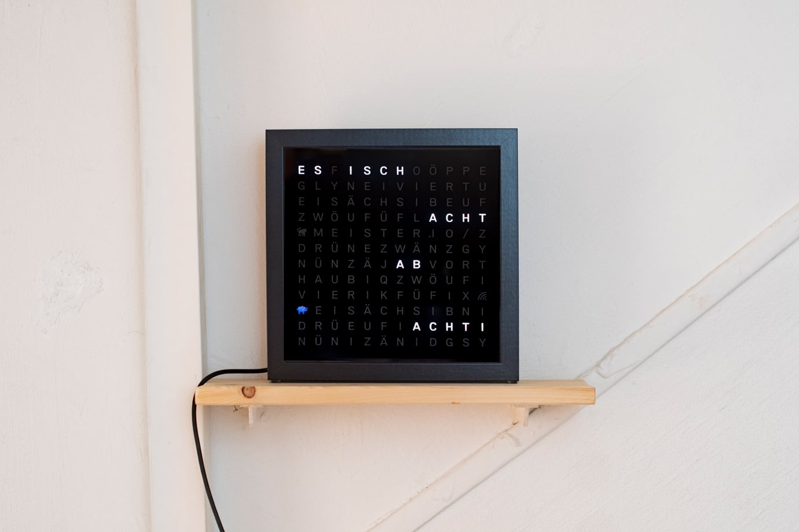

# WordClock Bärndütsch



LOLIN (WEMOS) D1 mini Lite (ESP8266) Wordclock Program
Based on scripts and snippets from:
Rui Santos http://randomnerdtutorials.com
neotrace https://www.instructables.com/id/WORK-IN-PROGRESS-Ribba-Word-Clock-With-Wemos-D1-Mi/
and others 

This version uses a DS3231 RTC clock module to store the time and date 
and a LDR (photoresistor) to adjust the brightness of the LEDs.

If you are looking for the old versions, you can find them here:  
[-2ea44f)](https://github.com/manuelmeister/WordClockBerndeutsch/tree/legacy-version)
[-f5822a)](https://github.com/manuelmeister/WordClockBerndeutsch/tree/ino-version)


## Install

Setup [Platformio](https://docs.platformio.org/en/latest/core/quickstart.html) and install dependencies with:  
```sh
pio pkg install
```

else see the requirements in the [platformio.ini](platformio.ini) file

### Configuration

It adjusts the brightness according to the sensor brightness.
If you want to run this without a sensor, you can comment out
the `#define BRIGHTNESS_SENSOR` line in [settings.h](src/settings.h).

### Upload to arduino
```sh
pio run --t upload
```
you may need to change the port in the [platformio.ini](platformio.ini) file

## Requirments
See [Requirements](/design/Requirements.md)

## Todos
- Settings Page
- Customizable Colors or HomeKit integration

## Contributors
Main work: Manuel Meister  
Initial efforts: Kurt Meister  
Refactoring and automated summertime conversion: Manuel Meister

